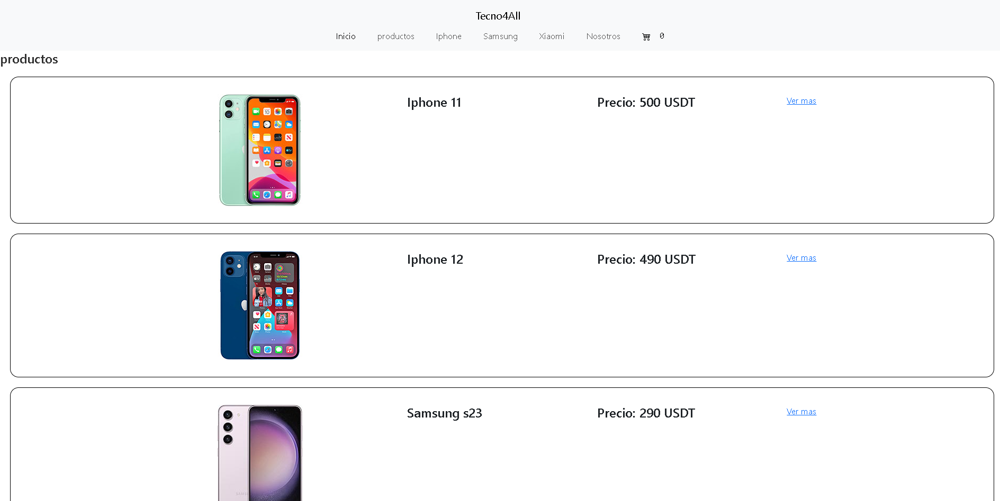
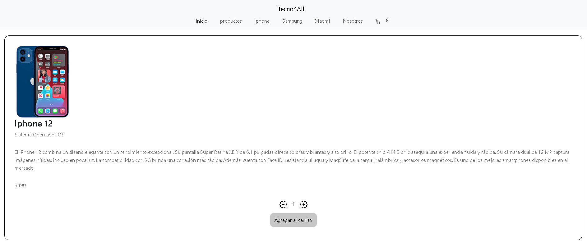
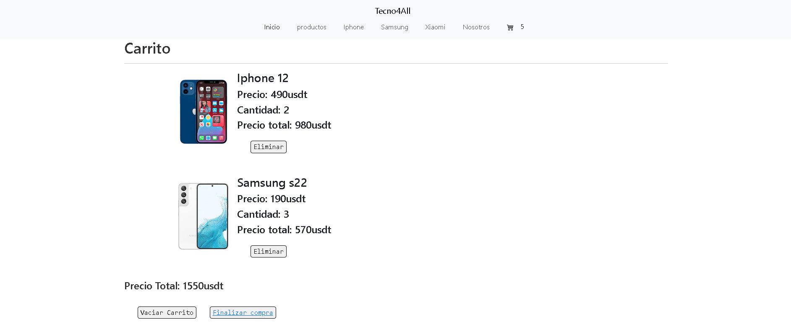
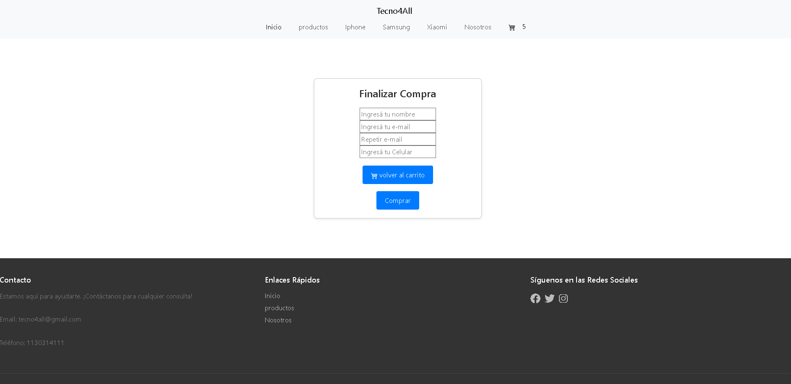
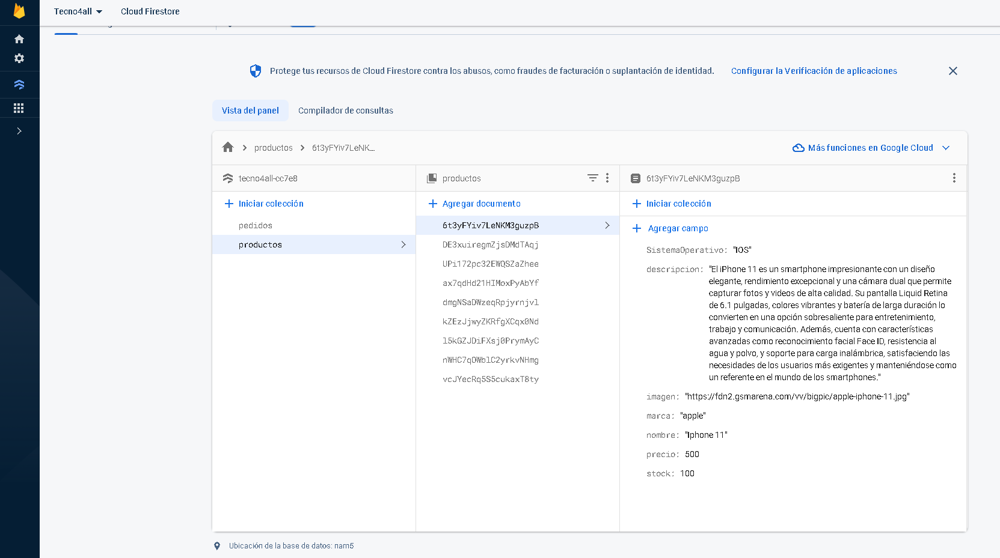
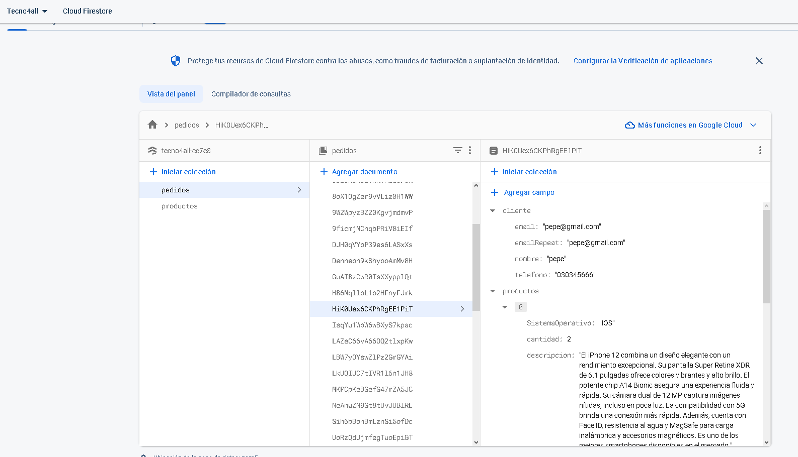

<h1>Tienda de celulares Tecno4all</h1>
 
 
<h3> se aplico  lo siguiente:  </h3>

➖ JSX y transpiling  
➖ Componentes  
➖ Promises, asincronía y MAP  
➖ Consumir API's (modelo cliente - servidor)  
➖ Hooks, Estados, Props, Children y Patrones  
➖ Montaje - Actualizacion - Desmontaje  
➖ Routing y navegación  
➖ Eventos (intercambiabilidad - abstraccion)  
➖ Context (Contex Provaider - Custom Provider)  
➖ Técnicas de rendering  
➖ Firebase  
➖ Optimizacion de codigo  

<h2> Descripcion del Proyecto </h2>

➕ Es un Ecommerce de venta de celulares, donde podras filtrar por distintas marcas y ver los datalles de cada modelo.  

 

<h2>  Detalles del producto </h2>
➕  podemos observar información adicional acerca del producto. Notamos que tenemos la posibilidad de aumentar o disminuir la cantidad que deseamos adquirir, para luego ir al carrito.   

<h2> Carrito de Compras </h2>
➕ Esta seccion posee toda la informacion de los productos agrgados con el sub total de la compra y el total, donde contamos con la posiblidad de vaciar el carrito, elimiar el producto cargado o finalizar comprar, ingrensando al ultimo boton mencionado te dirige al formulario . 

 <h2>   Formulario </h2>
➕ En estaa seccion el cliente debe completar el  formulario, el cual valida los campos que no esten vacios.
 
Se  verifica que el correo cargado originalmente sea igual al de abajo, ademas se verifica que en la parte de telefono solo se ingresen numeros   
 Luego genera la orden de la compra. 

➕ Los productos estan cargaodos en Firebase.  

<h2>  Orden generada y final de compra</h2>
➕ Una vez que el cliente complete el formulario correctamente se generara la orden de compra, mostrando su nombre y  numero de orden, luego la pagina lo deriva a productos   

➕ Para finalizar la compra se envía a la base de datos de firebase con información del cliente y productos agregados al carrito.  

